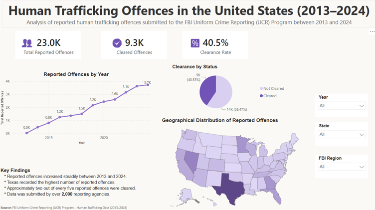

# Human Trafficking Offences in the United States Dashboard (Power BI)

This project is an interactive Power BI dashboard built using human trafficking offence data from the FBI Uniform Crime Reporting (UCR) Program. It was created to practise using Power BI, Power Query, and DAX while analysing a real-world public safety dataset.

The dashboard provides an overview of reported human trafficking offences in the United States between 2013 and 2024. Users can explore offence trends over time, analyse clearance rates, compare states and FBI regions, and examine the geographical distribution of offences using interactive filters and visualisations.

---

## Project Objectives

- Prepare and transform the human trafficking dataset.
- Analyse offence trends using Power BI.
- Build an interactive dashboard with KPIs and visualisations.
- Compare reported offences across states and FBI regions.
- Present key insights in a clear and interactive dashboard.

---

## Live Dashboard

**[View the Interactive Power BI Dashboard](https://app.powerbi.com/view?r=eyJrIjoiOTI1YWJhNDYtMzI0Yy00MWMwLThmNGMtNTVlYThmMDg2NGQ4IiwidCI6IjNlYTdjMTI4LWM2MDEtNDQ3OS1hMDAzLWUxNGQwMGMwYjVjYiJ9)**

---

## Dataset

The dataset contains reported human trafficking offences submitted to the **FBI Uniform Crime Reporting (UCR) Program** between **2013 and 2024**. It includes information on reported offences, cleared offences, states, FBI regions, and reporting agencies.

Before building the dashboard, the data was cleaned and transformed in Power BI using Power Query. Additional DAX measures were created to calculate key performance indicators, including the clearance rate.

| Column | Description |
|---------|-------------|
| `Year` | Reporting year |
| `State` | US state where the offence was reported |
| `FBI Region` | FBI region for each state |
| `Reported Offences` | Number of reported human trafficking offences |
| `Cleared Offences` | Number of offences cleared by law enforcement |
| `Clearance Status` | Indicates whether an offence was cleared |
| `Reporting Agency` | Agency that submitted the data |

---

## Data Source

The data used in this project was obtained from the **FBI Uniform Crime Reporting (UCR) Program** and includes reported human trafficking offences submitted by more than 2,000 law enforcement agencies across the United States.

---

## Tools Used

- Power BI Desktop
- Power Query
- DAX
- Data Modelling
- Data Visualisation

---

## Project Files

- [HumanTraffickingDashboard.pbix](dashboard/HumanTraffickingDashboard.pbix)

---

## 📷 Dashboard Preview

The dashboard includes interactive filters that allow users to explore reported offences by year, state, and FBI region.

---

## Key Findings

Some of the insights from the dashboard include:

- Reported human trafficking offences increased steadily between 2013 and 2024.
- Around **23,000 offences** were reported during the study period.
- Approximately **40.5%** of reported offences were cleared.
- Texas recorded the highest number of reported offences.
- Nearly three out of every five reported offences remained unresolved.

---

## What I Learned

This project helped me improve my Power BI skills by working with a real-world crime dataset.

The biggest challenge was preparing the data for analysis and creating DAX measures to calculate the key performance indicators used throughout the dashboard. I also spent time improving the layout to ensure the dashboard was clear, easy to navigate, and visually consistent.

By completing this project, I became more confident using Power Query for data transformation, DAX for calculations, and Power BI to create interactive dashboards that communicate data clearly.

---

## Skills Demonstrated

- Data cleaning
- Power Query
- Data modelling
- DAX
- KPI development
- Dashboard design
- Data visualisation
- Interactive reporting

---

## Author

**Wioletta Zajac**
