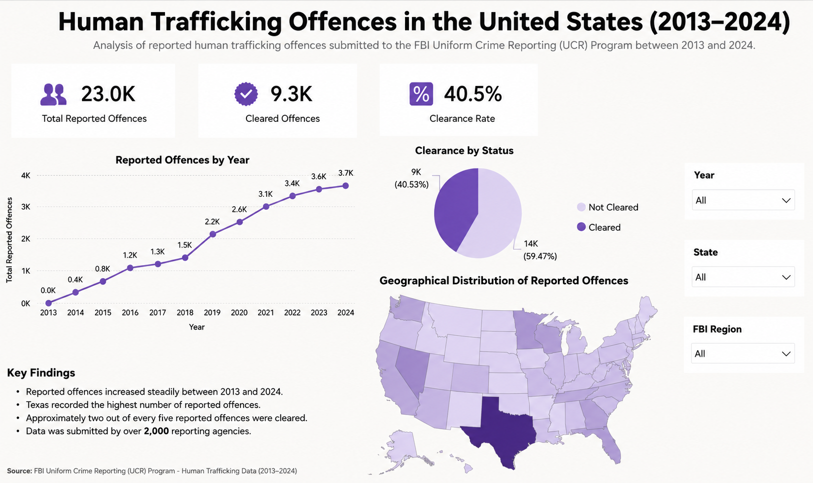

# Human Trafficking Offences in the United States Dashboard (Power BI)

This project is an interactive Power BI dashboard analysing human trafficking offences reported in the United States between 2013 and 2024. Using data from the FBI Uniform Crime Reporting (UCR) Program, the dashboard explores reporting trends, clearance rates, regional patterns, and state-level comparisons through interactive visualisations.

The project was created to strengthen my Power BI skills while working with a real public safety dataset, with a particular focus on data preparation, DAX calculations, and dashboard design.

---

## Project Overview

The dashboard allows users to:

- Explore reported offences over time.
- Compare reported and cleared offences.
- Analyse clearance rates across states and FBI regions.
- Identify geographical patterns using an interactive map.
- Filter results by year, state, and FBI region.

---

## Live Dashboard

**[View the Interactive Power BI Dashboard](https://app.powerbi.com/view?r=eyJrIjoiOTI1YWJhNDYtMzI0Yy00MWMwLThmNGMtNTVlYThmMDg2NGQ4IiwidCI6IjNlYTdjMTI4LWM2MDEtNDQ3OS1hMDAzLWUxNGQwMGMwYjVjYiJ9)**

---

## Dataset

The dashboard uses data from the FBI Uniform Crime Reporting (UCR) Program covering human trafficking offences reported between **2013 and 2024**.

The original dataset was cleaned and transformed in **Power Query** before being modelled in Power BI. Several **DAX measures** were created to calculate KPIs such as total offences, cleared offences, and overall clearance rate.

| Column | Description |
|---------|-------------|
| **Year** | Reporting year |
| **State** | US state where the offence was reported |
| **FBI Region** | FBI region assigned to each state |
| **Reported Offences** | Total reported offences |
| **Cleared Offences** | Number of offences cleared by law enforcement |
| **Clearance Status** | Indicates whether an offence was cleared |
| **Reporting Agency** | Agency submitting the report |

---

## Data Source

The data comes from the **FBI Uniform Crime Reporting (UCR) Program** and includes submissions from more than 2,000 law enforcement agencies across the United States.

---

## Tools & Technologies

- Power BI Desktop
- Power Query
- DAX
- Data Modelling
- Data Visualisation

---

## Project Files

- `dashboard/HumanTraffickingDashboard.pbix`

---

## Dashboard Preview

The dashboard includes interactive slicers that allow users to explore the data by year, state, and FBI region.

---

## Key Insights

Analysis of the dataset revealed several notable trends:

- More than **23,000** human trafficking offences were reported between 2013 and 2024.
- Reported offences generally increased over the study period.
- Around **40.5%** of offences were cleared by law enforcement.
- Texas recorded the highest number of reported offences.
- Nearly **60%** of reported offences remained uncleared.

---

## What I Learned

Working on this project gave me practical experience of building an end-to-end Power BI solution using a real-world dataset.

The most time-consuming part was preparing the data for analysis and creating DAX measures that accurately calculated the dashboard KPIs. I also focused on designing a clean, consistent layout so that users could quickly understand the key findings and explore the data through interactive filters.

Overall, the project improved my confidence with Power Query, DAX, data modelling, and dashboard design.

---

## Skills Demonstrated

- Data Cleaning
- Power Query
- Data Modelling
- DAX
- KPI Development
- Dashboard Design
- Data Visualisation
- Interactive Reporting

---

## Author

**Wioletta Zajac**
